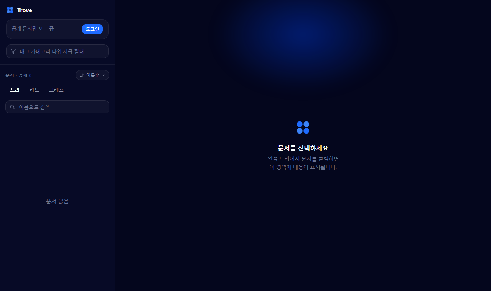

# Trove (`gdoc`)

개인용 개발 산출물 **HTML 문서 관리 도구**. 로컬에서 생성한 HTML 문서를 업로드하면, 웹 뷰어에서 폴더 트리·카드·**지식 그래프**로 탐색하고 읽을 수 있습니다. 한국어 UI, 1인 사용자.

> 신규 HTML 문서 **작성**(처음부터 만들기)은 이 저장소의 범위 밖입니다(별도 스킬이 담당). 여기서는 **발행 · 열람 · 편집(파일/AI) · 하이라이트**를 다룹니다.



## 기능 요약

- **업로드/발행** — 로컬 HTML(`gdoc-meta` 포함)을 Supabase에 발행. `content_hash` 기반 `new/updated/unchanged/duplicate` 분류.
- **열람** — 폴더 트리 · 카드 · 지식 그래프, 이름 검색 + 메타 필터(AND), 정렬, 다크/라이트, 반응형.
- **문서 관리(CLI·뷰어)** — 이동(`mv`/`move-file`), 이름 변경(`rename`), 메타 수정(`meta`), 폴더 생성/이름변경/삭제, 공유 링크.
- **본문 편집(CLI)** — `get`(본문 출력) · `edit --file`(HTML 교체) · `revert`(직전 편집 되돌리기). 낙관적 동시성(`--if-match`) · 위험 전환 확인(`--confirm`) · 편집 전 스냅샷.
- **하이라이트 + 메모(뷰어, 로그인 시)** — 본문 드래그 → 하이라이트, 키워드 칩(편집/삭제/궁금/중요/확인) + 자유 메모, 유저별 저장(RLS), 헤더 🔆 메뉴 · 사이드바 "하이라이트" 모드로 탐색·점프.
- **AI 편집(CLI)** — `edit --instruction "…"` 또는 `edit --from-highlights`로 로컬 codex/claude가 문서를 편집. 사용된 편집/삭제 하이라이트만 소비.
- **지식 그래프** — 로컬 임베딩(무료)으로 내용 유사도 기반 관련 문서 연결(`analyze`).

## 구성

```
gdoc/
  shared/      # CLI·뷰어 공유 순수 로직 (zod 스키마, 트리, 정렬, 그래프, 앵커) — 단위 테스트
  cli/         # gdoc CLI: 업로드 / get·edit·revert / 문서·폴더 관리 / AI 편집 / analyze
  viewer/      # Trove 뷰어 — Vite + React (트리·카드·그래프, 문서·폴더 편집, 하이라이트·메모)
  supabase/    # Postgres 마이그레이션(문서·폴더·공유링크·하이라이트) + Edge Function(admin-docs)
```

- **백엔드**: Supabase — Postgres(`documents`), Auth, Storage. 인증 없는 방문자는 공개 문서만, 로그인한 소유자는 전부.
- **호스팅**: 뷰어는 Vercel 정적 배포(`DEPLOY.md` 참고). 문서 본문/자산은 Supabase Storage(public/private 버킷).

## 사전 준비

1. Supabase 프로젝트 생성 → Hosting 불필요, **Postgres·Auth·Storage** 사용.
2. `cp .env.example .env` 후 채우기:
   - `SUPABASE_URL`, `SUPABASE_SERVICE_ROLE_KEY` — CLI 전용(서버 키, **절대 커밋·노출 금지**)
   - `VITE_SUPABASE_URL`, `VITE_SUPABASE_ANON_KEY` — 뷰어용(공개 안전, RLS 보호)
3. 마이그레이션 적용: `supabase/migrations/*.sql`을 순서대로 Supabase SQL Editor에 실행(또는 `supabase db push`).
4. Auth → 소유자 계정 1개 생성 후 그 사용자의 UID를 `OWNER_UID`와 `VITE_OWNER_UID`에 설정합니다.
5. viewer에서 문서/폴더를 수정하려면 `supabase/functions/admin-docs` Edge Function을 배포합니다. 이 함수도 `OWNER_UID`와 일치하는 사용자만 쓰기를 허용합니다.

## 사용 방법

1. **문서 작성** — HTML을 만들 때 `<head>`에 아래 메타 블록을 넣습니다(제목·태그·카테고리·경로·공개범위).
2. **업로드** — `bun run gdoc upload <폴더>` 로 폴더 안의 `*.html` 파일들을 한 번에 발행합니다(본문/자산 → Storage, 메타 → Postgres). 폴더는 "올릴 HTML 모음"일 뿐이고, 뷰어의 **폴더 트리는 로컬 폴더 구조가 아니라 각 문서의 `path` 메타**로 구성됩니다.
3. **열람·정리** — 뷰어(로컬 `bun run dev` 또는 배포 URL)에서 트리/카드/그래프로 탐색하고, 문서를 클릭하면 페이지로 읽습니다. 로그인 상태에서는 문서 편집, 이름 변경, 폴더 생성/변경/삭제, 문서 드래그 이동을 할 수 있습니다.
4. **그래프(선택)** — `bun run gdoc analyze` 실행 후 로그인하면 태그 기반 지식 그래프를 봅니다.

### 공개 / 비공개 (`visibility`)

문서마다 메타의 `visibility`로 지정합니다(기본 `private`).

| | `public` | `private` |
|---|---|---|
| 누가 보나 | 누구나(비로그인 포함) | **소유자만**(로그인 시) |
| 저장 | Storage `public` 버킷(공개 URL) | Storage `private` 버킷(서명 URL) |
| 표시 | 트리/카드/그래프에 항상 | 로그인 후에만, 자물쇠 아이콘 |

- **로그인**: 사이드바의 `로그인`(데스크톱) 또는 바텀시트(모바일)에서 소유자 이메일·비밀번호로 로그인합니다. 로그인 사용자의 UID가 `OWNER_UID`와 같으면 비공개 문서와 편집 기능이 열립니다. 로그아웃하면 공개 문서만 보입니다.
- 권한은 클라이언트가 아니라 **Postgres RLS + Storage 정책 + Edge Function owner check**로 강제됩니다. 비로그인 상태에선 비공개 문서 메타가 전달되지 않고, private Storage 객체도 서명 URL을 만들 수 없습니다.
- 문서 row의 `owner_uid`는 CLI 업로드 시 `OWNER_UID`로 기록됩니다. private 문서 조회 정책은 `visibility = 'public' or auth.uid() = owner_uid`입니다.

## 문서 메타 형식

각 HTML `<head>`에 메타 블록을 넣으면 CLI가 읽습니다:

```html
<script type="application/json" id="gdoc-meta">
{
  "type": "tech-note",
  "title": "React Query 캐싱",
  "tags": ["react", "data-fetching"],
  "category": "frontend",
  "createdAt": "2026-06-22T12:00:00Z",
  "visibility": "private",
  "path": "playground/tech-notes/react-query"
}
</script>
```

- `type`: `tech-note | overview | change-log | feature-spec | deploy-test | index`
- `visibility`: `public | private` (기본 private)
- `path`(선택): 트리 폴더 경로(슬래시 구분). 문서 식별자 = `slug(path)`. **생략 가능** — `--auto-path`(codex/claude) 또는 `<project|category>/<title>` 폴백으로 자동 결정.
- `uid`(선택): 지식 그래프 노드의 안정적 식별자
- `tags`(선택, 기본 `[]`), `createdAt`: ISO-8601

## CLI

bun으로 실행(`.env` 자동 로드):

```bash
bun install
bun run gdoc upload docs                # 폴더 안 *.html 일괄 업로드
bun run gdoc upload note.html           # 단일 파일도 가능
bun run gdoc upload docs --auto-path    # path 없는 문서는 codex/claude가 자동 배치
bun run gdoc get <id|path>              # 현재 문서 HTML을 stdout으로 출력
bun run gdoc edit <id|path> --file new.html              # 본문을 새 HTML로 교체
bun run gdoc edit <id|path> --instruction "오타 고쳐"     # 로컬 codex/claude로 AI 편집
bun run gdoc edit <id|path> --from-highlights            # 편집/삭제 하이라이트를 지시로 AI 편집
bun run gdoc revert <id|path>           # 직전 편집 본문으로 되돌리기(1단계)
bun run gdoc meta <id|path> --title "..." --tags a,b
bun run gdoc mv <id|path> "folder/new-name"
bun run gdoc move-file <id|path> "folder"
bun run gdoc rename <id|path> "new-name"
bun run gdoc folder mkdir "folder/path"
bun run gdoc folder rename "old/path" "new-name"
bun run gdoc folder rmdir "empty/path"
bun run gdoc analyze                    # 임베딩 기반 지식 그래프 → private/graph/graph.json
bun run gdoc doctor                     # 환경 설정(.env·DB·버킷·node) 점검
```

**업로드 분류** — 각 문서를 기존 DB와 대조해 분류하고, `unchanged`/`duplicate`는 건너뜁니다. 끝에 `new=… updated=… unchanged=… duplicate=…` 요약을 출력합니다.

| 판정 | 기준 |
|---|---|
| `new` | 처음 보는 `docId(=slug(path))` |
| `updated` | 같은 docId, 내용 해시 다름 → 덮어쓰기 |
| `unchanged` | 같은 docId, 같은 해시 → skip |
| `duplicate` | 같은 해시가 **다른 docId**에 이미 존재 → skip(경고) |

- 중복/변경 판별은 `content_hash`(HTML의 sha256)로 결정론적·저비용.
- **`--auto-path`**: `path`가 없는 문서는 제목·태그·카테고리 + 기존 폴더 목록을 `codex`/`claude`에 주어 폴더를 자동 배치합니다. 엔진이 없으면 `<project|category>/<title>`로 폴백.
- `meta`/`mv`/`rename`/`folder rename`은 HTML의 `gdoc-meta`, `documents` row, Storage object key를 함께 갱신합니다. 먼저 `--dry-run`으로 이동 결과를 확인할 수 있습니다.

### 문서 편집 — `get` / `edit` / `revert`

- `gdoc get <ref>` — 현재 본문 HTML을 stdout으로 출력(CLI/AI 편집의 토대).
- `gdoc edit <ref> --file <경로>` — 본문을 통째로 교체. 파일의 `gdoc-meta`가 식별자의 source of truth이므로, path/visibility를 바꾸는 변경(이동·공개범위)은 `--confirm`이 필요합니다.
- 안전장치: `--if-match <hash>`(낙관적 동시성 — 원격이 그새 바뀌었으면 거부), `--dry-run`(적용 없이 분류 미리보기), **편집 전 스냅샷** → `gdoc revert <ref>`로 직전 본문 복구(1단계).
- 전체 교체(`edit --file`/재업로드)는 그 문서의 하이라이트를 정리하고, **메타 전용 이동(`mv`/`move-file`/folder rename)은 하이라이트를 유지**합니다(FK cascade).

### AI 편집 — `--instruction` / `--from-highlights`

로컬 **codex/claude**(아래 `--auto-path`와 동일 요건)로 문서를 편집합니다. 뷰어가 아니라 CLI에서 실행합니다.

```bash
gdoc edit <ref> --instruction "오타 고치고 어색한 문장 다듬어"   # 자유 지시
gdoc edit <ref> --from-highlights                             # 편집/삭제 하이라이트를 지시로
  [--dry-run] [--engine codex|claude] [--if-match <hash>] [--confirm]
```

- `--from-highlights`: 그 문서의 `편집`/`삭제` 하이라이트 + 메모를 지시로 변환합니다(정보 태그 `궁금`/`중요`/`확인`은 무시). 적용 후 **사용된 하이라이트만 소비**하고 나머지는 유지(재앵커).
- LLM 출력은 검증(완결된 HTML · `gdoc-meta` 유효 · 문서 식별자 불변)을 통과해야만 적용됩니다. 비결정적이므로 `--dry-run`으로 먼저 확인하길 권장하고, 결과가 나쁘면 `gdoc revert`로 되돌립니다.
- 문서(수십 KB) 편집은 LLM이 전체 HTML을 다시 출력하므로 **수십 초~수 분** 걸릴 수 있습니다(타임아웃 300s).
- ⚠️ 프라이버시: AI 편집은 문서 **본문 전체**를 codex/claude 제공자로 전송합니다.

### `analyze` — 임베딩 기반 지식 그래프

각 문서 **본문**을 로컬 임베딩 모델(`Xenova/all-MiniLM-L6-v2`, Transformers.js)로 벡터화해, **코사인 유사도**로 관련 문서를 연결합니다(`kind: "semantic"`). 태그가 겹치지 않아도 내용이 비슷하면 엣지가 생기고, 유사도 그래프의 연결 요소로 **클러스터**가 만들어집니다. 결과는 `private/graph/graph.json`(소유자 전용)에 저장됩니다.

- **로컬 전용·무료**: API 키·외부 호출 없음. 모델은 첫 실행 시 1회 다운로드(~90MB)되어 캐시됩니다.
- **Node 필요**: 임베딩은 Node 서브프로세스(`cli/embed-worker.mjs`)에서 실행됩니다(bun이 onnx 백엔드를 로드하지 못해 분리). `node`가 PATH에 있어야 합니다.
- **증분 분석**: 임베딩 벡터를 `content_hash`와 함께 `private/graph/embeddings.json`에 캐시합니다. 재실행 시 **해시가 바뀐(신규/변경) 문서만 다시 임베딩**하고, 변경이 전혀 없으면 그래프를 그대로 두고 즉시 종료합니다.
- 클러스터 라벨은 현재 카테고리 기반(결정론적)입니다.

### codex / claude 연동 (auto-path · 선택)

`--auto-path`(자동 폴더 배치)는 로컬에 **codex 또는 claude CLI**가 설치·로그인돼 있어야 동작합니다. 없으면 `<project|category>/<title>`로 폴백합니다.

설치/로그인(둘 중 하나만 있으면 됨):

```bash
# 옵션 A — Codex (OpenAI). 비대화형이라 CLI 자동화에 권장(빠름)
npm install -g @openai/codex
codex login                 # 또는 OPENAI_API_KEY / CODEX_API_KEY 환경변수

# 옵션 B — Claude (Anthropic)
npm install -g @anthropic-ai/claude-code
claude                      # 최초 실행 시 로그인, 또는 ANTHROPIC_API_KEY 환경변수
```

- CLI는 **codex → claude 순으로 자동 감지**하고, 둘 다 없거나 실패하면 폴백합니다(추가 설정 불필요 — PATH에 있으면 됨).
- `claude`(`claude -p`)는 동작하지만 호출당 느립니다. 빠른 자동화엔 **codex 권장**.
- ⚠️ **프라이버시**: `--auto-path` 사용 시 문서 **메타데이터(제목·태그·카테고리)**가 codex/claude 제공자로 전송됩니다(본문은 전송하지 않음). `analyze`는 로컬 임베딩이라 아무것도 전송하지 않습니다.

## 뷰어

```bash
cd viewer
bun install
bun run dev        # http://localhost:5173
bun run build      # dist/
```

- 트리 / 카드 / **그래프** 뷰 전환, 이름 검색 + 메타 필터(AND), 정렬, 데스크톱·모바일 반응형
- 소유자 로그인 상태의 트리 context menu: 새 폴더, 폴더 이름 변경, 빈 폴더 삭제, 파일 이름 변경, 메타정보 편집
- 파일을 폴더 row로 드래그하면 해당 폴더로 이동합니다.
- 문서 헤더의 편집 버튼에서 title/path/tags/category/type/visibility를 수정합니다.
- 그래프 뷰는 소유자 전용, zoom/pan 지원
- **하이라이트(로그인 시)**: 본문 드래그 → 팝오버에서 하이라이트/키워드 즉시 지정, 키워드 칩(편집/삭제/궁금/중요/확인) + 메모 편집, 헤더 🔆 메뉴와 사이드바 "하이라이트" 모드에서 목록·점프, 고아(orphaned) 표시. 마크는 iframe 안에서 문서 테마에 맞게 렌더되며 유저별(RLS)로 저장됩니다.
- 문서 헤더의 **ID 복사** 버튼으로 CLI(`edit`/`get` 등)에 쓸 ref를 복사.
- 저장/삭제 등은 토스트로 피드백.
- 배포: `DEPLOY.md` 참고(Vercel)

## 테스트

```bash
bun run test   # vitest — shared 순수 로직(스키마·트리·정렬·그래프·앵커) + cli(업로드·편집·정리 훅·AI 편집)
```
